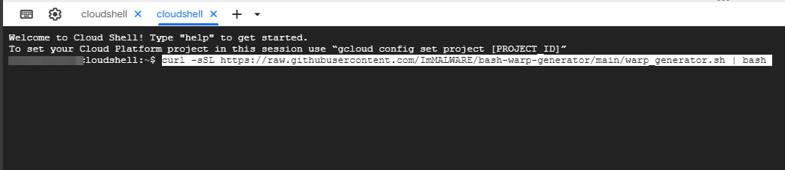
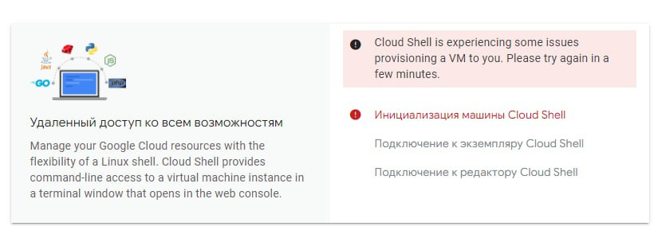

> Фиксим тормоза в Discord и YouTube — умелец написал инструкцию по обходу любых замедлений. 

Делаем с помощью клиента **AmneziaWG** и конфига **WARP**. Так как само приложение **Wireaguard** не работает в **России**, мы воспользуемся его улучшенной версией, защищенной от обнаружения системами DPI.

### Рабочий вариант 🏆:
  
  * Скачиваем AMNEZIA [Скачать](https://github.com/amnezia-vpn/amneziawg-windows-client/releases/download/1.0.0/amneziawg-amd64-1.0.0.msi)
  * Заходим сюда [Перейти](https://terminator.aeza.net/en/)
  * Выбираем **Debian**
  * Вставляем команду:

  *  ```bash <(wget -qO- https://raw.githubusercontent.com/ImMALWARE/bash-warp-generator/main/warp_generator.sh)``` > Вписываем в консоль `Enter` и ждем конца запущенной задачи.
  *  Копируем ссылку и вставляем в браузер. Готово!

### `🚩 Не рабочий` Вариант 1️⃣:
<details>
  <summary>Просмотреть</summary>
  
  * Для начала вырубаем GoodbyeDPI и другие софты, такие как VPN, которые могут помешать нормальной работе приложения;

  * Заходим в консоль Google по этой [ссылке](https://shell.cloud.google.com/?pli=1&show=ide%2Cterminal)

  * Вставляем следующую команду в консоль и ждем:

  * ```curl -sSL https://raw.githubusercontent.com/ImMALWARE/bash-warp-generator/main/warp_generator.sh | bash```



  * В конце получаем ссылку, по которой нужно перейти и скачать уже готовый конфиг **WARP**;

  * Теперь качаем клиент AmneziaWG с официального репозитория GitHub, в котором мы будем использовать этот конфиг - [здесь](https://github.com/amnezia-vpn/amneziawg-windows-client/releases/download/1.0.0/amneziawg-amd64-1.0.0.msi)

  * Как только загрузка будет завершена - запускаем прогу, жмем кнопку **«Добавить туннель»** в левом нижнем углу и выбираем наш файл **WARP.conf**;

  * После проделанных действий выбираем сверху наш туннель и нажимаем **«Подключить»**.
</details>

### Если вы не можете зайти в Google PowerShell: (относиться только к Вариант 1️⃣)
<details>
  <summary>Просмотреть</summary>
  
  * > Скачайте [Tor](https://www.torproject.org/download/) и попробуйте снова!

  * `Пример ошибки:` <br>

</details>

###  `🚩 Не рабочий` Вариант 2️⃣:
<details>
  <summary>Просмотреть</summary>
  
  * Скачиваем AMNEZIA [Скачать](https://github.com/amnezia-vpn/amneziawg-windows-client/releases/download/1.0.0/amneziawg-amd64-1.0.0.msi)
  * Заходим сюда [Перейти](https://colab.research.google.com/)
  * `pip install google-colab-shell` > Нажимаем `Enter`. Начинает установка.
  * `from google_colab_shell import getshell` > Нажимаем `Enter` ждем 5 - 10 секунд.
  * `getshell()`<br> 
  `getshell(height=400)` > Нажимаем `Enter` откроет консоль. <br>
  
  *  ```curl -sSL https://raw.githubusercontent.com/ImMALWARE/bash-warp-generator/main/warp_generator.sh | bash``` > Вписываем в консоль `Enter` и ждем конца запущенной задачи (15-30 секунд).
</details>
 
###  `🚩 Не рабочий` Публичный WARP.conf `💀 ОСТОРОЖНО` 
[Скачать](https://cdn.discordapp.com/attachments/1007444026821193739/1293291749380460676/WARP.conf?ex=6706d74d&is=670585cd&hm=c4b0f421706660b1bb5d4c58a8adb1af459cff63557429f6b6182ff59b513725&)

### Если все еще нужна помощь. Писать сюда [клик](https://discord.com/channels/@me/178971143032537088)

